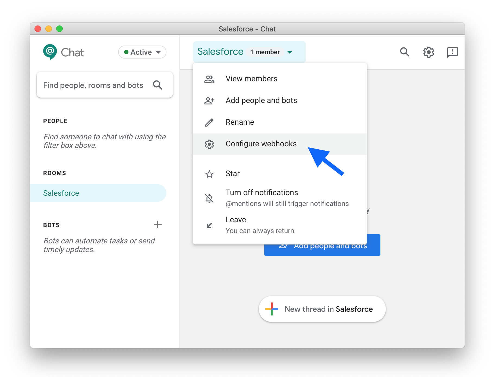
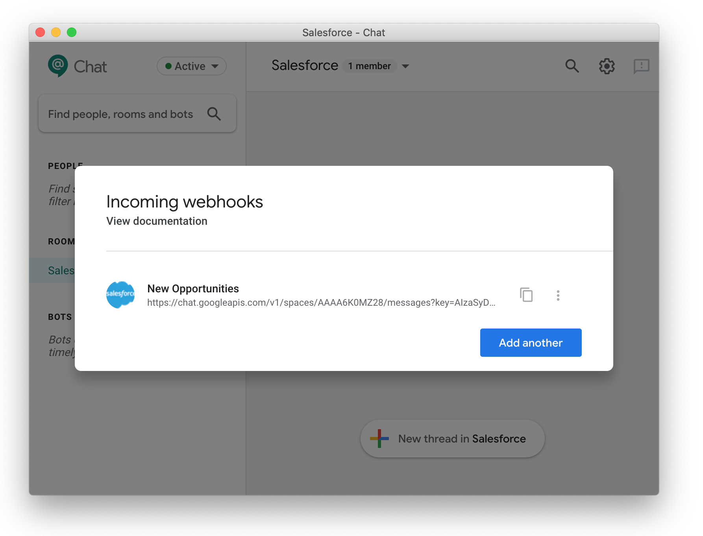
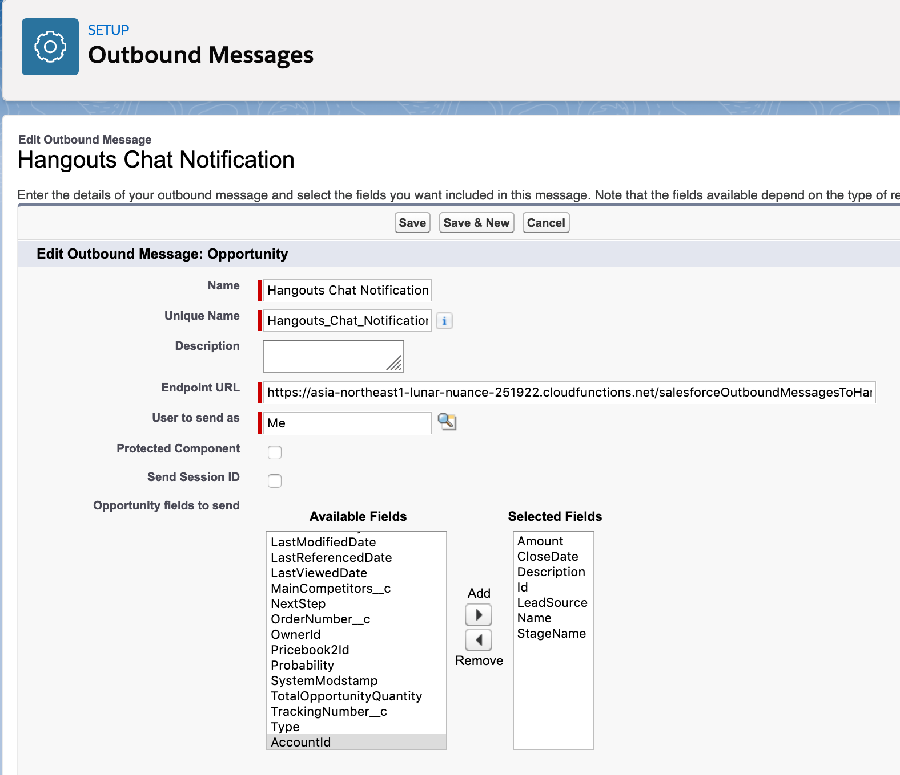

# Salesforce Outbound Messages to Hangouts Chat

> This Google Cloud Function takes Salesforce Outbound Messages and forwards them to a (given) Hangouts Chat webhook with formatting applied.

## Usage

### 1. Deploy this function:

```
gcloud functions deploy salesforceOutboundMessagesToHangoutsChat --trigger-http --allow-unauthenticated --runtime nodejs10 --region asia-northeast1
```

### 2. Create a webhook in an existing Hangouts Chat room:





> *TIP: Use the following for your avatar URL: https://c1.sfdcstatic.com/content/dam/web/en_us/www/images/nav/salesforce-cloud-logo-sm.png*

### 3. Create the pass-through URL:

[URLEncode](https://www.urlencoder.org/) your webhook URL and append it to your Cloud Function as value for the `url` querystring parameter:

`https://my-great-cloud-function.com/salesforceOutboundMessagesToHangoutsChat?url=<urlencoded-string-here>`

### 4. Add a Salesforce Outbound Message action to a Workflow Rule:



Don't forget to activate the new workflow rule!